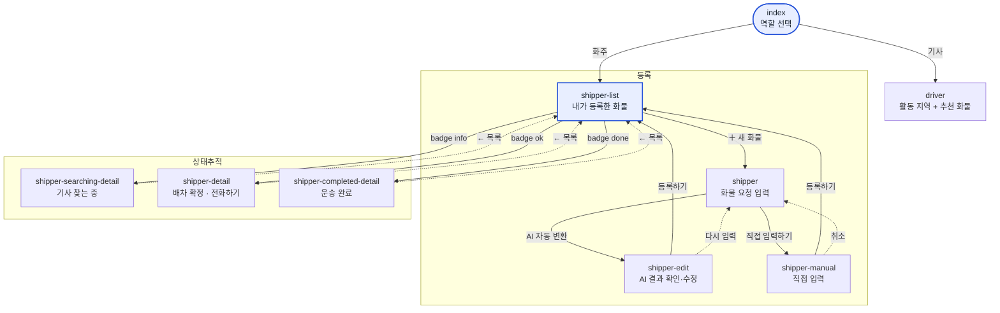

# 퍼블리싱 — 작업 프로세스

React로 구현하기 전에 화면을 정적 HTML로 먼저 확정하는 공간이다. 여기서 마크업·클래스명·화면 흐름을
합의하고, 그대로 `src/pages/*`로 옮긴다. 빌드에 포함되지 않으니 프레임워크·번들러 없이 파일을 직접 열면 된다.

스타일 규칙(색·타이포·터치 타깃·컴포넌트 클래스)은 [DESIGN.md](DESIGN.md)에 있다. 이 문서는 "어떻게 작업하는가"만 다룬다.

## 화면 목록

| 파일 | 화면 | React 대응 |
|---|---|---|
| `index.html` | 역할 선택 (화주 / 기사) | `RoleSelectPage/` |
| `shipper-list.html` | 내 화물 요청 목록 | `ShipperPage/MyCargoList.tsx` |
| `shipper.html` | 카톡 붙여넣기 → AI 화물 등록 | `ShipperPage/CargoRequestForm.tsx` |
| `shipper-manual.html` | 화물 정보 직접 입력 (AI 실패 대체 경로) | 미구현 |
| `shipper-edit.html` | AI 파싱 결과 확인·수정 | `ShipperPage/CargoSummaryCard.tsx` |
| `shipper-searching-detail.html` | 기사 찾는 중 상세 | 미구현 |
| `shipper-detail.html` | 배차 확정 상세 | `ShipperPage/MatchedDriverCard.tsx` |
| `shipper-completed-detail.html` | 운송 완료 상세 | 미구현 |
| `driver.html` | 기사 — 활동 지역 설정 + 추천 화물 | `DriverPage/` |
| `style.css` | 전 화면 공용 스타일 (단일 파일) | `src/theme/theme.ts` + 각 컴포넌트 Emotion |

화면 이동은 `<a href>`로만 한다. JS 없이 링크만 눌러도 전체 플로우가 돌아가야 한다.

## 페이지 프로세스



실선은 CTA를 눌러 앞으로 가는 길, 점선은 취소·뒤로. 화면 이동은 전부 `<a href>`다 — JS 없이 링크만 눌러도
전체 플로우가 돌아가야 한다.

### 화주 — 화물 등록

1. **`shipper-list` 내가 등록한 화물** — 진입점. 우상단 `＋ 새 화물`로 등록을 시작한다.
2. **`shipper` 화물 요청 입력** — 카톡 원문을 textarea에 붙여넣고 `AI 자동 변환`.
   그 아래 `또는` 구분선 + `직접 입력하기` 링크가 대체 경로다. **AI가 실패해도 등록은 막히지 않는다**가 이 화면의 핵심.
3. **`shipper-edit` 화물 정보 확인** — AI 파싱 결과를 보여주고 못 채운 항목만 고치게 한다.
   - 상단 `banner warn`에 `6개 중 4개를 채웠어요 · 2개만 확인해주세요` — 남은 일의 양을 먼저 알린다.
   - 못 채운 입력에는 `.field-need`(주황 테두리), 요약 카드의 같은 항목에는 `badge warn 입력 필요`.
   - 운임 칸에는 구간 평균 운임을 힌트로 붙여 저가 등록을 막는다.
   - 하단 `sticky-cta`: `다시 입력`(→ `shipper`) / `등록하기`(→ `shipper-list`).
4. **`shipper-manual` 직접 입력** — 항목 7개(출발지·출발일시·도착지·도착일시·화물종류·중량·운임) 폼.
   `shipper-edit`과 폼 구조가 같고, 값이 비어있고 배너가 없는 상태다. 두 화면을 따로 만들지 말고 같은 폼으로 본다.

### 화주 — 등록 후 상태 추적

`shipper-list`의 각 항목은 상태 배지에 따라 서로 다른 상세로 간다. **상태가 곧 화면**이다.

| 배지 | 목록 표시 | 상세 화면 | 상세의 기사님 카드 |
|---|---|---|---|
| `badge info` 기사 찾는 중 | `2시간째 지원한 기사가 없어요` / `기사 3명이 확인했어요` | `shipper-searching-detail` | `.matching-state` — 트럭 아이콘 + 안내문 (`aria-live="polite"`) |
| `badge ok` 배차 확정 | 기사명 · 차종 | `shipper-detail` | 기사 정보 `datagrid` + `전화하기`(`tel:`) |
| `badge done` 운송 완료 | — (항목에 `.is-done`) | `shipper-completed-detail` | 기사 정보 `datagrid`, **CTA 없음** |

- 세 상세 화면은 상단 `화물 정보` 카드(`.cargo-summary`)를 **동일한 마크업**으로 공유한다. 배지와 아래 카드만 다르다.
- `기사 찾는 중`의 안내 문구는 두 종류다: 지연 경고(`.is-warn`)와 진행 상황. 목록 문구와 상세 문구가 같은 값을 쓴다.
- 뒤로가기는 전부 우상단 `← 목록`. 브라우저 뒤로가기에 의존하지 않는다.

### 기사

`index` → `driver` 한 화면에서 끝난다.

1. **활동 지역 설정** — 출발지/도착지를 시·도 + 시·군·구 2단 셀렉트로 고른다.
2. **추천 화물** — 조건에 맞는 오퍼 카드 목록. 카드 위계는 DESIGN.md §6을 따른다
   (출발지·도착지·가격이 가장 크고, `.offer-card.best`가 3px 테두리로 첫 카드를 강조).
3. 카드마다 `적정 운임` / `운임 N% 낮음` 배지로 판단 근거를 먼저 주고, 그 다음 `숨기기` · `수락` 두 버튼.

기사 회원가입·프로필 화면은 퍼블리싱에 없다. 목데이터 전제다 (`index.html` 푸터에 명시).

## 보는 방법

```sh
open docs/publishing/index.html          # 파일 그대로 열기
python3 -m http.server -d docs/publishing 4173   # 서버가 필요하면
```

Pretendard 폰트만 CDN에서 받아오고 나머지는 전부 로컬 파일이다.

## 작업 순서

1. **화면 추가** — 가장 가까운 기존 HTML을 복사해서 시작한다. `<header class="brand">` / `<main>` /
   `<footer class="note">` 뼈대는 건드리지 않는다.
2. **스타일** — 기존 클래스로 먼저 만들어 본다. 새 클래스가 정말 필요하면 `style.css` **v3 블록(395행 이후)**에
   추가하고, 같은 이름을 다크모드 블록에도 반드시 넣는다 (DESIGN.md §1).
3. **링크 연결** — 새 화면으로 들어오는 진입점과 나가는 뒤로가기를 양쪽 다 건다. 링크가 끊긴 화면은 리뷰에서 잡힌다.
4. **React 이식** — 확정된 마크업을 `src/pages/`로 옮긴다. 이때 HTML의 클래스명은 버리고 Emotion `styled()`로
   다시 쓰되, 색·크기 값은 `theme.ts` 토큰을 쓴다 (하드코딩 금지 — 루트 `CLAUDE.md` 참고).
   퍼블리싱 파일은 지우지 않고 그대로 둔다. 디자인 기준 문서 역할을 계속 한다.

## 규칙

- 퍼블리싱 HTML에 JS를 넣지 않는다. 상태·인터랙션은 React 이식 단계의 몫이다.
- 데이터는 목업 하드코딩으로 둔다. 실제 값과 형태만 맞으면 된다 (`src/mocks/data/*.csv`와 같은 시드).
- 이식했다고 HTML을 지우거나 React 쪽에 맞춰 수정하지 않는다. 둘이 갈라지면 React가 최신이다.
- 시니어 기사님 대상 제약(14px 미만 글씨 금지, 터치 타깃 52px)은 퍼블리싱 단계에서 이미 지킨다. 나중에 못 고친다.
